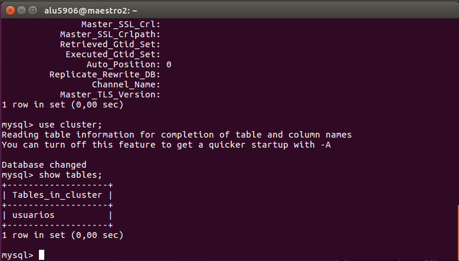
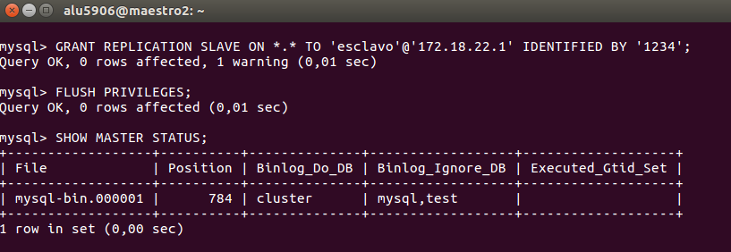
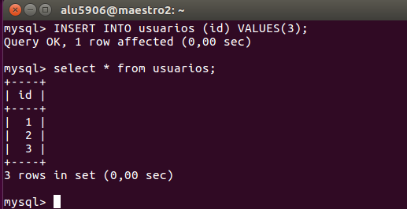

# Manual replicación MySQL

## 1. Replicación Maestro-Esclavo

### Configuración MYSQL Maestro


```console

alu5906@maestro2:~$ cd /etc/mysql/mysql.conf.d/
alu5906@maestro2:/etc/mysql/mysql.conf.d$ ls
mysqld.cnf  mysqld_safe_syslog.cnf
alu5906@maestro2:/etc/mysql/mysql.conf.d$

```

- Configuramos el fichero `mysqld.cnf` para que las máquinas se puedan comunicar correctamente.

```console

alu5906@maestro2:/etc/mysql/mysql.conf.d$ sudo cat mysqld.cnf
[sudo] password for alu5906:
#
# The MySQL database server configuration file.
#
# You can copy this to one of:
# - "/etc/mysql/my.cnf" to set global options,
# - "~/.my.cnf" to set user-specific options.
#
# One can use all long options that the program supports.
# Run program with --help to get a list of available options and with
# --print-defaults to see which it would actually understand and use.
#
# For explanations see
# http://dev.mysql.com/doc/mysql/en/server-system-variables.html

# This will be passed to all mysql clients
# It has been reported that passwords should be enclosed with ticks/quotes
# escpecially if they contain "#" chars...
# Remember to edit /etc/mysql/debian.cnf when changing the socket location.

# Here is entries for some specific programs
# The following values assume you have at least 32M ram

[mysqld_safe]
socket		= /var/run/mysqld/mysqld.sock
nice		= 0

[mysqld]
#
# * Basic Settings
#
user		= mysql
pid-file	= /var/run/mysqld/mysqld.pid
socket		= /var/run/mysqld/mysqld.sock
port		= 3306
basedir		= /usr
datadir		= /var/lib/mysql
tmpdir		= /tmp
lc-messages-dir	= /usr/share/mysql
skip-external-locking
#bind-address		= 127.0.0.1
key_buffer_size		= 16M
max_allowed_packet	= 16M
thread_stack		= 192K
thread_cache_size       = 8
myisam-recover-options  = BACKUP
query_cache_limit	= 1M
query_cache_size        = 16M

# Configuración para el master

log_error = /var/log/mysql/error.log
server-id		= 1
log_bin			= /var/log/mysql/mysql-bin.log
expire_logs_days	= 10
max_binlog_size         = 100M
binlog_do_db		= cluster
binlog_ignore_db	= mysql
binlog_ignore_db	= test

```

- Reiniciamos el servicio para establecer los cambios.

```console
alu5906@maestro2:~$ sudo systemctl restart mysql.service
```

- Ahora abriremos una consola mysql, en esta vamos a:
  - Crear una base de datos de prueba que vamos a replicar.
  - Crear un usuario con permisos de `Replication slave`.
  - Ejecutar el comando `show master status`, que nos mostrará el fichero con la información log de las bases de datos que queremos replicar.

```console

alu5906@maestro2:/etc/mysql/mysql.conf.d$ mysql -u root -p
Enter password:
Welcome to the MySQL monitor.  Commands end with ; or \g.
Your MySQL connection id is 3
Server version: 5.7.21-0ubuntu0.16.04.1-log (Ubuntu)

Copyright (c) 2000, 2018, Oracle and/or its affiliates. All rights reserved.

Oracle is a registered trademark of Oracle Corporation and/or its
affiliates. Other names may be trademarks of their respective
owners.

Type 'help;' or '\h' for help. Type '\c' to clear the current input statement.

mysql> create database cluster;
Query OK, 1 row affected (1,65 sec)

mysql> GRANT REPLICATION SLAVE ON *.* TO 'esclavo'@'172.18.22.2' IDENTIFIED BY '1234';
Query OK, 0 rows affected, 1 warning (0,00 sec)

mysql> flush privileges;
Query OK, 0 rows affected (1,87 sec)

mysql> show master status;
+------------------+----------+--------------+------------------+-------------------+
| File             | Position | Binlog_Do_DB | Binlog_Ignore_DB | Executed_Gtid_Set |
+------------------+----------+--------------+------------------+-------------------+
| mysql-bin.000001 |      770 | cluster      | mysql,test       |                   |
+------------------+----------+--------------+------------------+-------------------+
1 row in set (0,00 sec)

mysql>
```

## Configuración Mysql Slave


```console

alu5906@maestro2:~$ cd /etc/mysql/mysql.conf.d/
alu5906@maestro2:/etc/mysql/mysql.conf.d$ ls
mysqld.cnf  mysqld_safe_syslog.cnf
alu5906@maestro2:/etc/mysql/mysql.conf.d$

```

- Configuramos el fichero `mysqld.cnf`, en este caso en el servidor que utilizaremos como esclavo, la información necesaria esta al final del siguiente cuadro.

```console

alu5906@maestro2:/etc/mysql/mysql.conf.d$ sudo cat mysqld.cnf
[sudo] password for alu5906:
#
# The MySQL database server configuration file.
#
# You can copy this to one of:
# - "/etc/mysql/my.cnf" to set global options,
# - "~/.my.cnf" to set user-specific options.
#
# One can use all long options that the program supports.
# Run program with --help to get a list of available options and with
# --print-defaults to see which it would actually understand and use.
#
# For explanations see
# http://dev.mysql.com/doc/mysql/en/server-system-variables.html

# This will be passed to all mysql clients
# It has been reported that passwords should be enclosed with ticks/quotes
# escpecially if they contain "#" chars...
# Remember to edit /etc/mysql/debian.cnf when changing the socket location.

# Here is entries for some specific programs
# The following values assume you have at least 32M ram

[mysqld_safe]
socket		= /var/run/mysqld/mysqld.sock
nice		= 0

[mysqld]
#
# * Basic Settings
#
user		= mysql
pid-file	= /var/run/mysqld/mysqld.pid
socket		= /var/run/mysqld/mysqld.sock
port		= 3306
basedir		= /usr
datadir		= /var/lib/mysql
tmpdir		= /tmp
lc-messages-dir	= /usr/share/mysql
skip-external-locking
#bind-address		= 127.0.0.1
key_buffer_size		= 16M
max_allowed_packet	= 16M
thread_stack		= 192K
thread_cache_size       = 8
myisam-recover-options  = BACKUP
query_cache_limit	= 1M
query_cache_size        = 16M

# Configuración para el master

log_error = /var/log/mysql/error.log
server-id		= 2
log_bin			= /var/log/mysql/mysql-bin.log
expire_logs_days	= 10
max_binlog_size         = 100M
binlog_do_db		= cluster
binlog_ignore_db	= mysql
binlog_ignore_db	= test

```

- Reiniciamos el servicio.

```console
alu5906@maestro2:~$ sudo systemctl restart mysql.service
```

- Ahora abrimos una consola `MySQL`, esta vamos a crear la base de datos vacía, y ejecutaremos el comando `CHANGE MASTER TO` para vincularla con el master, el contenido del comando se explica en las siguientes líneas.

>- MASTER_HOST=’192.168.0.18′: ip del servidor maestro (master).
>- MASTER_USER=’usuario-replica’: nombre del usuario utilizado para la >sincronización.
>- MASTER_PASSWORD='password-del-usuario': clave para el usuario definido.
>- MASTER_LOG_FILE=’mysql-bin.000001′: fichero log que hemos obtenido al >hacer la copia y consultar el servidor maestro (master).
>- MASTER_LOG_POS= "num-pos": posición de inicio de la sincronización, que hemos >obtenido del maestro al igual que el fichero.


```console

alu5906@maestro2:~$ mysql -u root -p
Enter password:
Welcome to the MySQL monitor.  Commands end with ; or \g.
Your MySQL connection id is 3
Server version: 5.7.21-0ubuntu0.16.04.1-log (Ubuntu)

Copyright (c) 2000, 2018, Oracle and/or its affiliates. All rights reserved.

Oracle is a registered trademark of Oracle Corporation and/or its
affiliates. Other names may be trademarks of their respective
owners.

Type 'help;' or '\h' for help. Type '\c' to clear the current input statement.

mysql> CREATE DATABASE cluster;
Query OK, 1 row affected (0,12 sec)

mysql> CHANGE MASTER TO MASTER_HOST='172.18.22.1', MASTER_USER='esclavo', MASTER_PASSWORD='1234', MASTER_LOG_FILE='mysql-bin.000001', MASTER_LOG_POS=770;
Query OK, 0 rows affected, 2 warnings (0,01 sec)

mysql> START SLAVE;
Query OK, 0 rows affected (0,01 sec)

mysql> SHOW SLAVE STATUS \G
*************************** 1. row ***************************
               Slave_IO_State: Waiting for master to send event
                  Master_Host: 172.18.22.1
                  Master_User: esclavo
                  Master_Port: 3306
                Connect_Retry: 60
              Master_Log_File: mysql-bin.000001
          Read_Master_Log_Pos: 770
               Relay_Log_File: maestro2-relay-bin.000002
                Relay_Log_Pos: 320
        Relay_Master_Log_File: mysql-bin.000001
             Slave_IO_Running: Yes
            Slave_SQL_Running: Yes
              Replicate_Do_DB:
          Replicate_Ignore_DB:
           Replicate_Do_Table:
       Replicate_Ignore_Table:
      Replicate_Wild_Do_Table:
  Replicate_Wild_Ignore_Table:
                   Last_Errno: 0
                   Last_Error:
                 Skip_Counter: 0
          Exec_Master_Log_Pos: 770
              Relay_Log_Space: 530
              Until_Condition: None
               Until_Log_File:
                Until_Log_Pos: 0
           Master_SSL_Allowed: No
           Master_SSL_CA_File:
           Master_SSL_CA_Path:
              Master_SSL_Cert:
            Master_SSL_Cipher:
               Master_SSL_Key:
        Seconds_Behind_Master: 0
Master_SSL_Verify_Server_Cert: No
                Last_IO_Errno: 0
                Last_IO_Error:
               Last_SQL_Errno: 0
               Last_SQL_Error:
  Replicate_Ignore_Server_Ids:
             Master_Server_Id: 1
                  Master_UUID: 341c4457-1f11-11e8-a758-080027e6f90f
             Master_Info_File: /var/lib/mysql/master.info
                    SQL_Delay: 0
          SQL_Remaining_Delay: NULL
      Slave_SQL_Running_State: Slave has read all relay log; waiting for more updates
           Master_Retry_Count: 86400
                  Master_Bind:
      Last_IO_Error_Timestamp:
     Last_SQL_Error_Timestamp:
               Master_SSL_Crl:
           Master_SSL_Crlpath:
           Retrieved_Gtid_Set:
            Executed_Gtid_Set:
                Auto_Position: 0
         Replicate_Rewrite_DB:
                 Channel_Name:
           Master_TLS_Version:
1 row in set (0,00 sec)

mysql>
```
- Al empezar el esclavo y ejecutar el comando `SHOW SLAVE STATUS \G` vemos por el resultado de algunos parámetros que el servicio esta encendido y a la espera del maestro para actualizar su información.

## Añadimos contenido a la base de datos "cluster" en el server maestro

- Vamos a conectarnos a la base de datos desde el servidor maestro e insertaremos información.

```console
mysql> use cluster;
Database changed
mysql> CREATE TABLE usuarios (id int(11) AUTO_INCREMENT, PRIMARY KEY (id)) Engine=MyISAM;
Query OK, 0 rows affected (0,00 sec)

mysql> show tables;
+-------------------+
| Tables_in_cluster |
+-------------------+
| usuarios          |
+-------------------+
1 row in set (0,00 sec)

mysql>
```


- Metemos datos a la tabla de usuarios.


## Comprobamos en el servidor slave que tenemos creado la tabla en la base de datos cluster




- Comprobamos los datos que están en la tabla de usuarios


# 2. Replicación Master a Master

## Configuración MASTER2

Vamos a reutilizar nuestro esclavo, pero en este caso haremos que sea a su vez el master de su propio master. Comprobamos con el comando show master status que tiene configurado su master.


- Creamos un usuario con permisos de `replication slave`, con el comando `Show master status` obtendremos la información necesaria para vincularlo con master1.

```console
mysql> GRANT REPLICATION SLAVE ON *.* TO 'esclavo'@'172.18.22.1' IDENTIFIED BY '1234';
Query OK, 0 rows affected, 1 warning (0,01 sec)

mysql> FLUSH PRIVILEGES;
Query OK, 0 rows affected (0,01 sec)

mysql> SHOW MASTER STATUS;
+------------------+----------+--------------+------------------+-------------------+
| File             | Position | Binlog_Do_DB | Binlog_Ignore_DB | Executed_Gtid_Set |
+------------------+----------+--------------+------------------+-------------------+
| mysql-bin.000001 |      784 | cluster      | mysql,test       |                   |
+------------------+----------+--------------+------------------+-------------------+
1 row in set (0,00 sec)
```



- Abrimos una consola MySQL desde **master1**, tenemos que decirle cual es nuestro servidor maestro haciendo uso del comando `CHANGE MASTER` y con la información obtenida desde el master2.

```console
mysql> CHANGE MASTER TO MASTER_HOST='172.18.22.2', MASTER_USER='esclavo', MASTER_PASSWORD='1234', MASTER_LOG_FILE='mysql-bin.000001', MASTER_LOG_POS=784;
Query OK, 0 rows affected, 2 warnings (5,40 sec)

mysql> START SLAVE;
Query OK, 0 rows affected (0,00 sec)

mysql> SHOW SLAVE STATUS \G
*************************** 1. row ***************************
               Slave_IO_State: Waiting for master to send event
                  Master_Host: 172.18.22.2
                  Master_User: esclavo
                  Master_Port: 3306
                Connect_Retry: 60
              Master_Log_File: mysql-bin.000001
          Read_Master_Log_Pos: 784
               Relay_Log_File: maestro1-relay-bin.000002
                Relay_Log_Pos: 320
        Relay_Master_Log_File: mysql-bin.000001
             Slave_IO_Running: Yes
            Slave_SQL_Running: Yes
              Replicate_Do_DB:
          Replicate_Ignore_DB:
           Replicate_Do_Table:
       Replicate_Ignore_Table:
      Replicate_Wild_Do_Table:
  Replicate_Wild_Ignore_Table:
                   Last_Errno: 0
                   Last_Error:
                 Skip_Counter: 0
          Exec_Master_Log_Pos: 784
              Relay_Log_Space: 530
              Until_Condition: None
               Until_Log_File:
                Until_Log_Pos: 0
           Master_SSL_Allowed: No
           Master_SSL_CA_File:
           Master_SSL_CA_Path:
              Master_SSL_Cert:
            Master_SSL_Cipher:
               Master_SSL_Key:
        Seconds_Behind_Master: 0
Master_SSL_Verify_Server_Cert: No
                Last_IO_Errno: 0
                Last_IO_Error:
               Last_SQL_Errno: 0
               Last_SQL_Error:
  Replicate_Ignore_Server_Ids:
             Master_Server_Id: 2
                  Master_UUID: ebd4fc8a-1f0f-11e8-9a5e-0800277e8971
             Master_Info_File: /var/lib/mysql/master.info
                    SQL_Delay: 0
          SQL_Remaining_Delay: NULL
      Slave_SQL_Running_State: Slave has read all relay log; waiting for more updates
           Master_Retry_Count: 86400
                  Master_Bind:
      Last_IO_Error_Timestamp:
     Last_SQL_Error_Timestamp:
               Master_SSL_Crl:
           Master_SSL_Crlpath:
           Retrieved_Gtid_Set:
            Executed_Gtid_Set:
                Auto_Position: 0
         Replicate_Rewrite_DB:
                 Channel_Name:
           Master_TLS_Version:
1 row in set (0,00 sec)

mysql>

```

Podemos comprobar que al iniciar a master1 como esclavo y mostrar el estado de la unión nos muestra que esta conectado.

## Entramos en la base de datos en el servidor master2 e insertamos datos

Vamos a comprobar que podemos insertar datos desde master2. (Antes al ser solo esclavo no podía hacer esto.)

```console
mysql> INSERT INTO usuarios (id) VALUES(3);
Query OK, 1 row affected (0,00 sec)

mysql> select * from usuarios;
+----+
| id |
+----+
|  1 |
|  2 |
|  3 |
+----+
3 rows in set (0,00 sec)

mysql>
```


- Comprobamos en el Servidor maestro1 y vemos con una consulta que tenemos el nuevo datos insertado.


